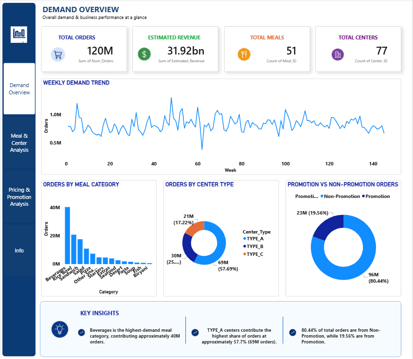
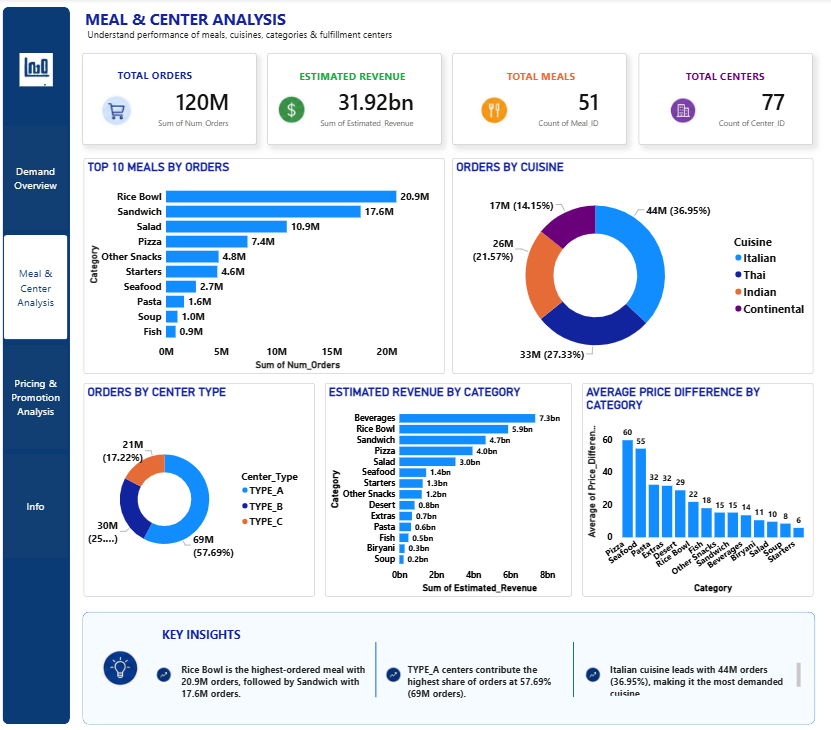
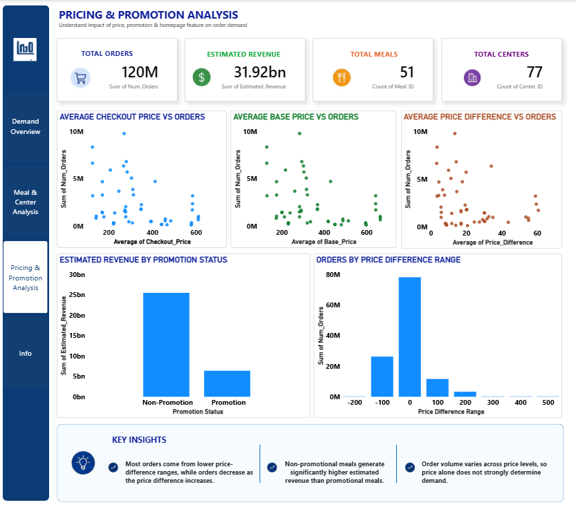
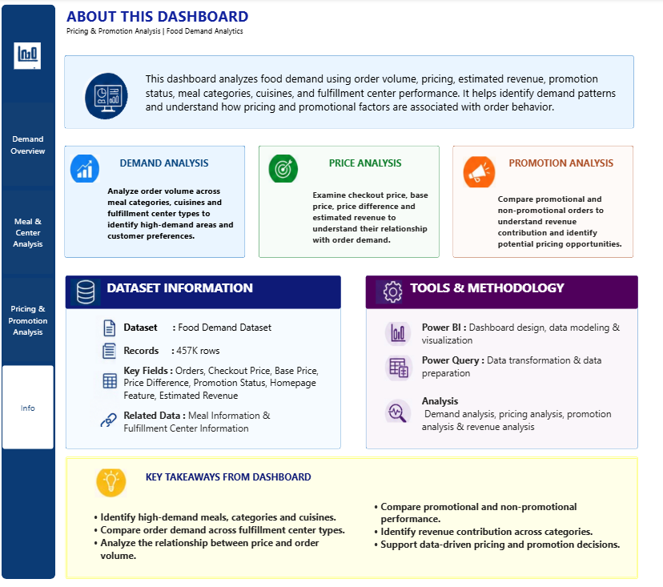

# Food Demand, Pricing & Promotion Analysis

## Project Overview
A Power BI dashboard analyzing food demand, pricing, promotion performance, estimated revenue, meal categories, cuisines, and fulfillment center performance.

## Dashboard Pages
- **Demand Overview** — overall orders, revenue, demand trends, meal categories, center types, and promotion status.
- **Meal & Center Analysis** — top meals, cuisines, center types, category revenue, and price differences.
- **Pricing & Promotion Analysis** — checkout price, base price, price difference, promotion performance, and order ranges.
- **Info** — dataset, tools, methodology, and key takeaways.

## Dataset
The dataset was obtained from Kaggle.

### Tables Used
- `train`
- `meal_info`
- `fulfilment_center_info`

## Tools Used
- Power BI
- Power Query
- DAX
- Data Modeling
- Data Visualization

## Key Insights
- Beverages are the highest-demand meal category, contributing approximately 40M orders.
- Type A fulfillment centers contribute the highest share of orders, approximately 57.7%.
- Around 80.4% of total orders are from non-promotional meals.
- Non-promotional meals generate substantially higher estimated revenue than promotional meals in this dataset.
- Most orders are concentrated around lower price-difference ranges.
- Order volume varies across price levels, so price alone does not fully explain demand.

## Project Structure
```text
Food-Demand-Pricing-Promotion-Analysis/
├── Food_Demand_Pricing_Promotion_Analysis.pbix
├── README.md
├── dataset/
│   ├── train.xlsx
│   ├── meal_info.xlsx
│   └── fulfilment_center_info.xlsx
└── screenshots/
    ├── demand-overview.png
    ├── meal-center-analysis.png
    ├── pricing-promotion-analysis.png
    └── info.png
```text

## Project Purpose
This project demonstrates practical Power BI skills in:
- Data cleaning and transformation
- Data modeling
- DAX measures
- KPI development
- Dashboard design
- Data visualization
- Business insight generation

## Dashboard Preview

### Demand Overview


### Meal & Center Analysis


### Pricing & Promotion Analysis


### Info


## Author
Evangelin Hosanna E S
